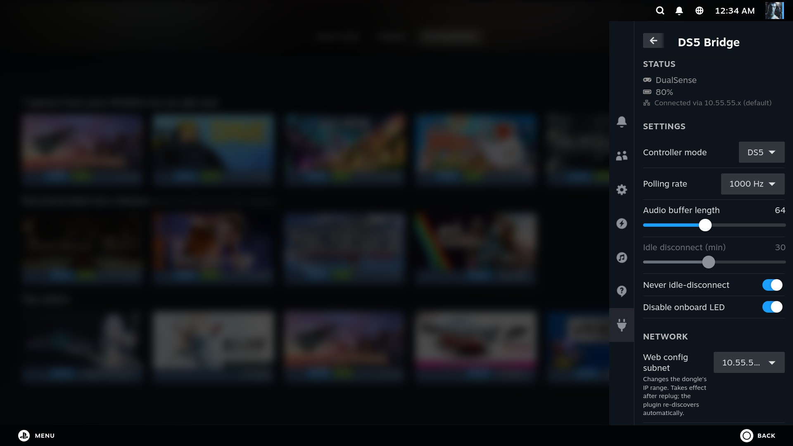
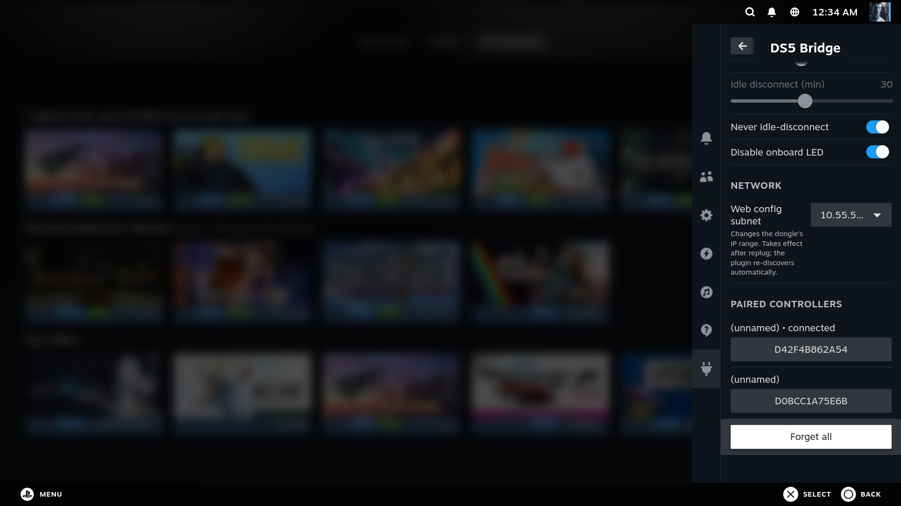

# DS5-Linux-Decky

[](https://github.com/kungaa/DS5-Linux-Decky/actions/workflows/build.yml)
[](https://github.com/kungaa/DS5-Linux-Decky/releases/latest)
[](LICENSE)

A [Decky Loader](https://github.com/SteamDeckHomebrew/decky-loader) plugin for the
[**DS5-Linux-Bridge**](https://github.com/kungaa/ds5-linux-bridge) dongle — a
USB-to-Bluetooth bridge for the Sony DualSense on a Raspberry Pi Pico 2 W. It
brings the dongle's web config page into the Steam Deck Quick Access Menu —
glanceable battery, connection status, and controller settings, without leaving
your game.

> **Requires the [DS5-Linux-Bridge](https://github.com/kungaa/ds5-linux-bridge)
> dongle.** This plugin is a client of the firmware's HTTP API (the dongle's
> embedded web page is the other client). Without the dongle it has nothing to
> talk to.

<p align="center">
  
  &nbsp;
  
</p>

## Features

- **Status** — battery %, charging state, and controller model (DualSense /
  DualSense Edge), polled ~every 4 s.
- **Settings** — controller mode, polling rate, audio buffer length,
  idle-disconnect timeout, and onboard LED, saved to the dongle on change.
- **Network** — shows which subnet the dongle answered on, and lets you switch
  the dongle's `webconfig_subnet` (the plugin re-discovers it automatically).
- **Paired controllers** — list, rename, forget, or forget-all bonded
  controllers.

The dongle's network interface only exists while a controller is connected, so
when nothing is connected the plugin shows *"No controller connected"* rather
than an error. It auto-discovers the dongle across all three selectable subnets
(`10.55.55.105` / `172.31.55.105` / `192.168.137.105`).

## Installation

Install [Decky Loader](https://decky.xyz/) first, then enable **Developer Mode**
in Decky settings (this reveals the install options below).

**Easiest — install from URL.** In Decky settings → **"Install Plugin from URL"**,
paste this permanent link (always points to the newest release):

```
https://github.com/kungaa/DS5-Linux-Decky/releases/latest/download/DS5-Bridge.zip
```

**Or — install from ZIP.** Download the latest `DS5-Bridge.zip` from the
[Releases page](https://github.com/kungaa/DS5-Linux-Decky/releases/latest), then
use **"Install Plugin from ZIP"** and pick the file.

Either way, open the **Quick Access Menu** (`•••` button) afterward — **DS5
Bridge** appears with a 🎮 icon.

> Not on the Decky store (the plugin is hardware-specific). Install from the URL
> or Releases page above.

### Troubleshooting

If the plugin shows "No controller connected" even though one is connected, the
Steam Deck's NetworkManager may not have leased an address on the dongle's
USB-NCM interface. Verify reachability from a terminal:

```bash
curl http://10.55.55.105/api/status
```

If that hangs or refuses, it's a host networking issue (DHCP/NetworkManager),
not the plugin.

## Development

Requires Node.js v16.14+ and `pnpm` v9 (`npm i -g pnpm@9`).

```bash
pnpm i            # install frontend deps
pnpm run build    # build the frontend to dist/index.js
```

The Python backend ([main.py](main.py)) uses only the standard library
(`urllib`), so there is no backend build step or Docker requirement. Re-run
`pnpm run build` after any change under `src/`.

### Releasing

Releases are automated. Bump `version` in [package.json](package.json), then push
a tag:

```bash
git tag v0.3.0
git push origin v0.3.0
```

GitHub Actions builds the plugin and publishes a Release with the installable zip
attached. See [.github/workflows/release.yml](.github/workflows/release.yml).

## Related

- [DS5-Linux-Bridge](https://github.com/kungaa/ds5-linux-bridge) — the dongle
  firmware this plugin controls (the source of truth for the HTTP API).

## License

BSD-3-Clause. See [LICENSE](LICENSE).
